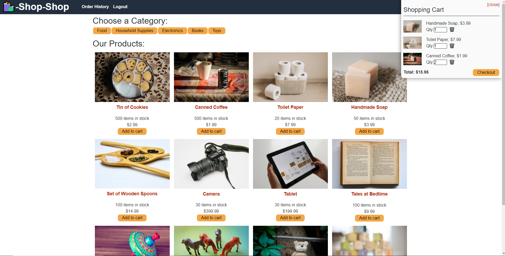

# State Challenge: Redux Store
  
### UCF Coding Boot-Camp Week 22 Challenge 
 

## Description
An e-commerce platform where users have the ability to browse products based on categories and view them on a sinbgle item format. Users will also be able to create accounts that can login and signout. Once signed in users will be able to checkout any products they have added to their account and pay for purchases with their card information. 
 

## Table of Contents
- [Usage](#Usage)
- [Features](#Features)
- [Production](#Production)
- [Questions](#Questions)
- [Contribution](#Contribution)

## Usage
- Visit deployed site to access application [here]().
- Users must make an account in order to checkout. 

## Features
- MongoDB and Mongoose are used for server connectivity.
- React rendered with state management taken out of the React ecosystem. 
- Refactored with Redux to manage global state instead of Context API.
- Stripe is utilized to enable users to pay for purchases on the platform.
- Smooth UI interface with user interactive interface. 
- Deployed with Heroku. 

## Production

## Questions
Please feel free to reach out for additional questions at:
 
- Email: Elysiayn@gmail.com (Wendy Lemus)
 
Visit my GitHub!
- [Elysiayn](https://github.com/Elysiayn)

 

### Contributions
- Modifications by: [Elysiayn](https://github.com/Elysiayn)
- Starter code provided by: [UCF Coding-Boot-Camp](https://github.com/coding-boot-camp)